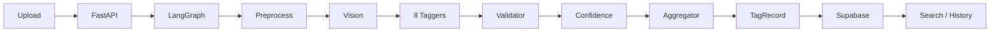

# System overview

High-level architecture of the Image Tagging Agent.

## Flow

1. **Client** uploads an image (single or bulk).
2. **FastAPI** (`src/server.py`) receives the file, builds initial state, invokes the graph.
3. **LangGraph** runs: preprocess → vision → fan-out to 8 taggers → tag_validator → confidence_filter → tag_aggregator.
4. **TagRecord** is returned; server optionally writes to **Supabase** (image_tags table).
5. **Frontend** shows tags, SaveToast, HistoryGrid; **Search** page filters by taxonomy.

## Components

| Layer | Location | Role |
|-------|----------|------|
| API | src/server.py | Routes, analyze, bulk, taxonomy, search. |
| Agent | src/image_tagging/ | Graph, nodes, taxonomy, schemas. |
| DB | src/services/supabase/ | Client, upsert, list, search_images_filtered, get_available_filter_values. |
| Frontend | app/, components/, lib/ (or frontend/) | Dashboard, Search, BulkUploader. |
