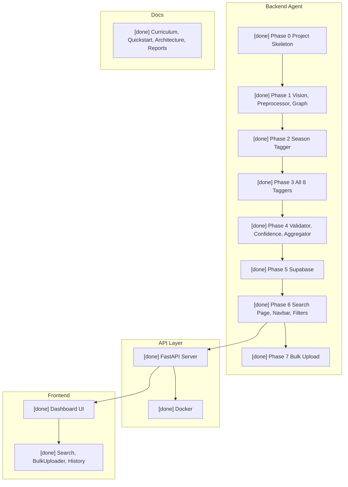

# Implementation Progress

**Last updated:** 2026-03-17  
**Currently working on:** Documentation and rules compliance.

Phases 0–7 complete. See [plans/](../plans/README.md) for phase setup guides.
